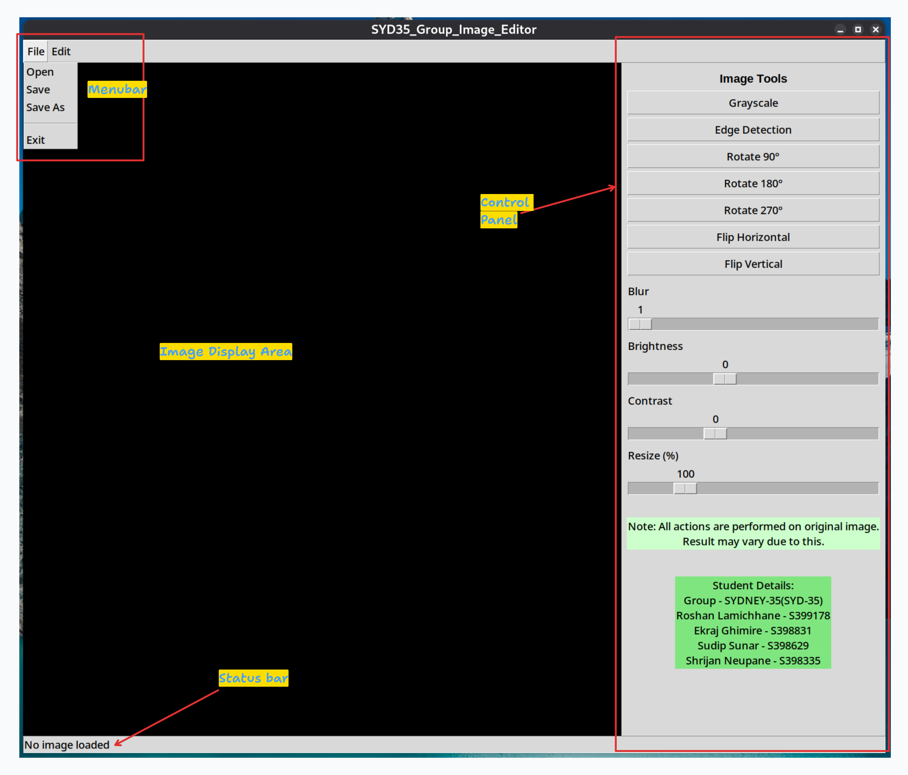
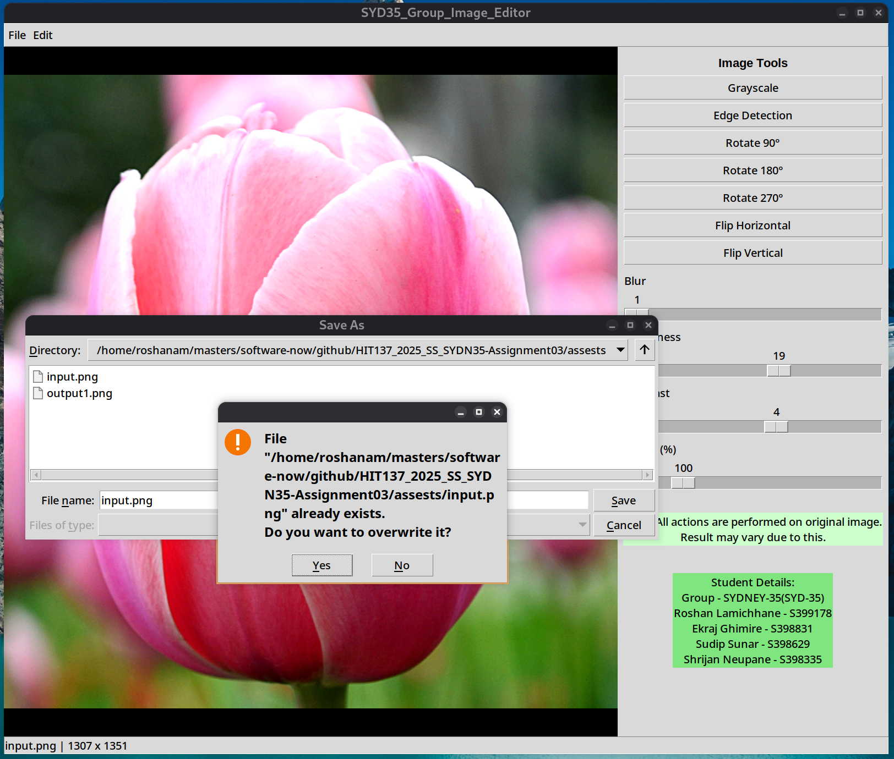

# HIT137_2025_SS_SYDN35-Assignment03
### Group- SYDNEY-35 (SYD-35)
### Group Members:
- Roshan Lamichhane - S399178
- Ekraj Ghimire - S398831
- Sudip Sunar - S398629
- Shrijan Neupane - S398335

### Group Contribution
| Member            | Contribution (%) |
| ----------------- | ---------------- |
| Roshan Lamichhane | 25%             |
| Ekraj Ghimire     | 25%             |
| Sudip Sunar       | 25%             |
| Shrijan Neupane   | 25%             |
### Run Program
- Clone the repository
- Must install `opencv-python` and `pillow` dependencies to run the program

```bash
pip install -r requirements.txt
# or 
pip install opencv-python pillow
```
- Run the program as
```bash
python editor.py
```

### Program Output
- Initial output

- Example of messagebox, status bar information and control panels used

